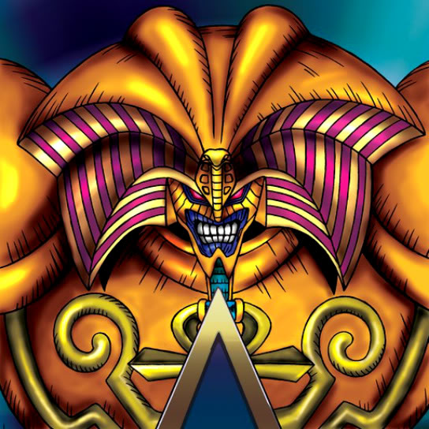

# Exodia


Boilerplate code generation 

```

[{
	"date": "YYYY-MM-DD HH:MM:SS",
	"generated": false,
	"models": [{
		"id": "__MODEL_ID__",
		"name": "__MODEL_NAME__",
		"properties": [{
			"name": "__PROPERTY_NAME__",
			"type": "String|Int|Bool|...|Object(__MODEL_ID__)|Array(__MODEL_ID__)",
			"key": "__PROPERTY_KEY__",
			"defaultValue": "__OPTIONAL_VALUE__"
		}]
	}],
	"services": [{
		"id": "__SERVICE_ID__",
		"name": "__SERVICE_NAME__",
		"isAPI": false,
		"publicFunctions": [{            
            "name": "__FUNCTION_NAME__",
            "type": "String|Int|Bool|...|ObjectType",
            "parameters": [{
                "name": "__PARAMETER_NAME__",
                "type": "String|Int|Bool|...|ObjectType"
            }]
		}],
        "publicVariables": [{
            "name": "__FUNCTION_NAME__",
            "type": "String|Int|Bool|...|ObjectType"
		}]
	}],
	"interactors": [{
		"id": "__INTERACTOR_ID__",
		"name": "__INTERACTOR_NAME__",
		"services": [{
			"id": "__SERVICE_ID__",
			"name": "__SERVICE_INSTANCE_NAME__"
		}],
		"publicFunctions": [{            
            "name": "__FUNCTION_NAME__",
            "type": "String|Int|Bool|...|ObjectType",
            "parameters": [{
                "name": "__PARAMETER_NAME__",
                "type": "String|Int|Bool|...|ObjectType"
            }]
		}],
        "publicVariables": [{
            "name": "__FUNCTION_NAME__",
            "type": "String|Int|Bool|...|ObjectType"
		}]
	}],
	"viewModels": [{
		"id": "__VIEWMODEL_ID__",
		"name": "__VIEWMODEL_NAME__",
		"interactors": [{
			"id": "__INTERACTOR_ID__",
			"name": "__INTERACTOR_INSTANCE_NAME__"
		}],
		"publicFunctions": [{            
            "name": "__FUNCTION_NAME__",
            "type": "String|Int|Bool|...|ObjectType",
            "parameters": [{
                "name": "__PARAMETER_NAME__",
                "type": "String|Int|Bool|...|ObjectType"
            }]
		}],
        "publicVariables": [{
            "name": "__FUNCTION_NAME__",
            "type": "String|Int|Bool|...|ObjectType"
		}]
	}],
	"views": [{
		"id": "__VIEW_ID__",
		"name": "__VIEW_NAME__",
        "viewModels": [{
			"id": "__VIEWMODEL_ID__",
			"name": "__VIEWMODEL_INSTANCE_NAME__"
		}]
	}],
	"cordinators": [{
        "id": "__COORDINATOR_ID__",
        "name": "__COORDINATOR_NAME__",
        "isRoot": true,
        "views": [{
            "id": "__VIEW_ID__"            
        }],
        "next": [{
            "id": "__COORDINATOR_ID__",
            "actionName": "__ACTION_NAME__"
        }],
        "type": "Push|Modal|Tabbar|Split"
    }]
}]

```
